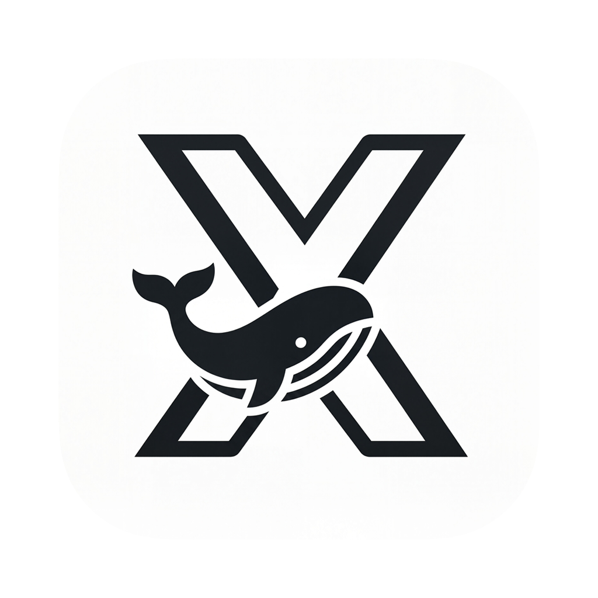

<p align="center">
  
</p>

<h1 align="center" style="margin-top: 0;">ShipyardX</h1>

<p align="center">A cross-platform Docker management client built with Tauri.</p>

## Features

- Manage remote Docker servers via SSH
- Monitor Docker status and troubleshoot access issues
- Manage containers, images, networks, and volumes
- Deploy containers with flexible configurations
- Access terminals, logs, and real-time events
- Configure port forwarding and Docker daemon settings
- Browse and deploy apps from app sources

## Requirements

- Node.js 20+
- pnpm 11
- Rust stable
- Platform dependencies required by Tauri

On macOS, install Xcode Command Line Tools:

```bash
xcode-select --install
```

## Development

After installing the required Tauri dependencies, run:

```bash
pnpm i
pnpm tauri dev
```

## Contributions

Issue and PR welcome!

## License

GPL-3.0 License. See [License here](./LICENSE) for details.
